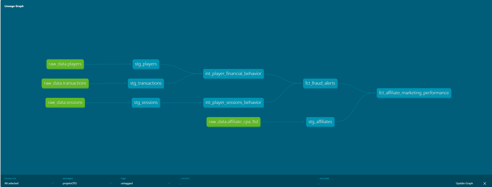
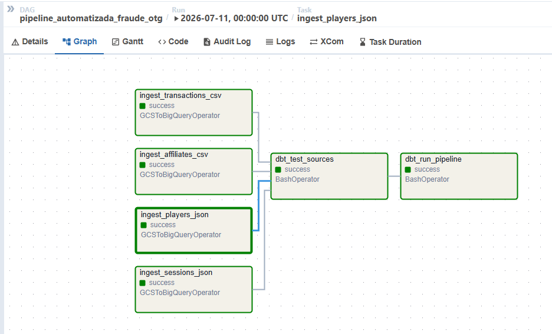
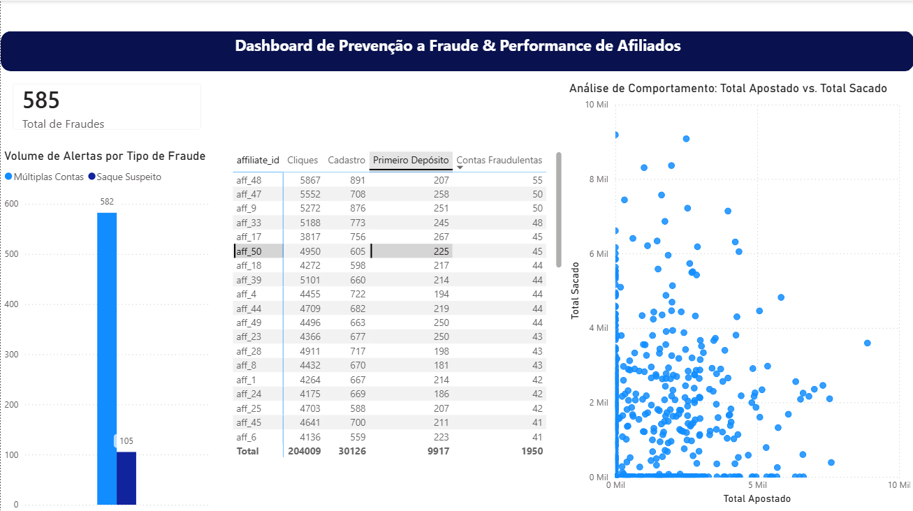

# 🛡️ Projeto OTG - Data Pipeline para Detecção de Fraude e Marketing

Este repositório contém a camada de transformação de dados do **projetoOTG**, um projeto estruturado para solucionar o desafio de engenharia de dados focado em detecção de fraudes em transações financeiras e análise de performance de marketing (afiliados)[cite: 1].

O ecossistema utiliza a arquitetura **Medallion (Bronze, Silver, Gold)**, implementada via **dbt Core** sobre o data warehouse **Google BigQuery**[cite: 1].

---

## 🏗️ Arquitetura de Dados & Linhagem



O pipeline foi projetado para operar de ponta a ponta seguindo o fluxo de dados abaixo[cite: 1]:

1. **Ingestão (Apache Airflow):** DAGs automatizadas realizam a extração dos dados heterogêneos (`.json` e `.csv`) da origem e efetuam a carga explícita de esquema no dataset bruto (`raw_data`) do BigQuery[cite: 1].
2. **Camada Bronze (Staging - dbt):** Consome do `raw_data` para realizar a higienização inicial, limpeza de strings e tipagem padronizada (`Views` otimizadas para custo)[cite: 1].
3. **Camada Silver (Intermediate - dbt):** Modela tabelas intermediárias consolidadas de comportamento financeiro e de acessos/sessões por jogador (`Tabelas`)[cite: 1].
4. **Camada Gold (Marts - dbt):** Modelos finais agregados de negócios prontos para consumo de ferramentas de BI (Power BI), divididos em datamarts de `fraud` (regras antifraude) e `marketing` (performance de afiliados)[cite: 1].

---

## 🧠 Regras de Negócio Implementadas (Camada Gold)

Para mitigar os riscos solicitados no escopo do case, duas lógicas analíticas automatizadas foram criadas via SQL no dbt[cite: 1]:

* **Saque sem Apostas (`flag_suspicious_withdrawal`):** Identifica usuários que realizam depósitos expressivos, executam saques quase integrais e movimentam menos de 20% do saldo em apostas reais (característica clássica de lavagem de dinheiro ou abuso de bônus de boas-vindas)[cite: 1].
* **Multi-Accounting (`flag_multi_accounting`):** Sinaliza contas de jogadores que registram logins originados de mais de 2 endereços de IP distintos ou aparelhos diferentes, visando mitigar ataques de *Account Takeover* ou criação de contas clonadas[cite: 1].

---

## 🚦 Estratégia de Cargas Justificada

| Dataset | Frequência | Tipo de Carga | Campo de Controle | Justificativa |
| :--- | :--- | :--- | :--- | :--- |
| **players** | Diária | Incremental | `created_at` | Crescimento constante e previsível. Evita o reprocessamento histórico de cadastros antigos. |
| **sessions** | Horária | Incremental | `timestamp` | Altíssimo volume de logs. Exige atualização frequente para barrar ataques em agora. |
| **transactions** | Horária | Incremental | `timestamp` | Volume crítico. Necessita de monitoramento ágil para travar saques fraudulentos antes da compensação bancária. |
| **affiliates** | Diária | Full Load | - | Base de tamanho reduzido enviada por parceiros. A carga total simplifica a atualização de cliques. |

---

## 🔗 Orquestração e Observabilidade (Apache Airflow)

A coordenação, o sequenciamento temporal e o monitoramento de integridade de toda a pipeline são gerenciados de forma centralizada pelo **Apache Airflow**[cite: 1]. A DAG mapeia as dependências de ponta a ponta, garantindo isolamento de processos e robustez contra falhas de rede ou indisponibilidade de APIs[cite: 1]:

* **Garantia de Fluxo:** O dbt só executa a compilação e teste das tabelas relacionais após a confirmação de sucesso absoluto da ingestão primária dos arquivos na camada RAW[cite: 1].
* **Observabilidade Ativa:** Integração de manipuladores de erro (`on_failure_callback`) conectados a webhooks corporativos para alertar o time de engenharia imediatamente em caso de quebra de tasks de produção[cite: 1].



---

## 🛡️ Governança e Qualidade de Dados (Data Quality)

O projeto implementa uma malha rígida de testes nativos do dbt em todas as portas de entrada de dados para garantir que dados corrompidos quebrem a pipeline antes de chegarem ao painel de BI[cite: 1]:
* Testes de **Unicidade** (`unique`) e **Não-Nulidade** (`not_null`) em chaves primárias (`player_id`, `session_id`, `transaction_id`)[cite: 1].
* Testes de **Valores Aceitos** (`accepted_values`) para garantir domínios estritos em campos como tipo de dispositivo (`mobile`, `desktop`) e operações financeiras (`deposit`, `withdraw`)[cite: 1].

---

## 📊 Dashboard Antifraude & Performance

Aqui está a visualização analítica final desenvolvida no Power BI, estruturada para o time de operações de risco identificar anomalias financeiras e fraudes de afiliados de forma imediata[cite: 1]:



---

## 🛠️ Como Executar o Projeto Localmente

### Pré-requisitos
* Python 3.10+ instalado
* Conta de serviço no Google Cloud Platform com a permissão *BigQuery Admin*

### Configuração do Ambiente Virtual
```bash
# Entrar no diretório do projeto e criar o ambiente virtual
cd projetoOTG
python3 -m venv venv
source venv/bin/activate

# Instalar dependências
pip install --upgrade pip
<<<<<<< HEAD
pip install dbt-bigquery
=======
pip install dbt-bigquery
```

### Configuração de Credenciais
Crie o arquivo de perfil do dbt fora da pasta do repositório em `~/.dbt/profiles.yml` e aponte para a sua chave privada JSON do GCP:
```yaml
projetoOTG_profile:
  target: dev
  outputs:
    dev:
      type: bigquery
      method: service-account
      keyfile: /home/seu_usuario/.../sua-chave.json
      project: seu-projeto-gcp-id
      dataset: dbt_projetoOTG_dev
      threads: 4
      timeout_seconds: 300
      location: us-east1
```

### Executando comandos do dbt
```bash
# Validar conexões
dbt debug

# Compilar e rodar todas as transformações Medallion
dbt run

# Executar a malha de testes de qualidade de dados
dbt test

# Gerar e iniciar o portal web de documentação
dbt docs generate
dbt docs serve
```
## 📊 Dashboard Antifraude & Performance
Aqui está a visualização analítica final desenvolvida no Power BI, estruturada para o time de operações de risco identificar anomalias financeiras e fraudes de afiliados de forma imediata:


>>>>>>> 553bcf65a214dd5219179a94953c6200e44957cd
